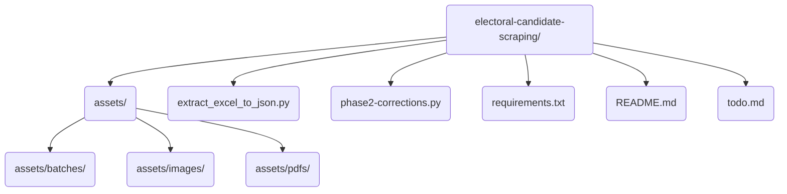
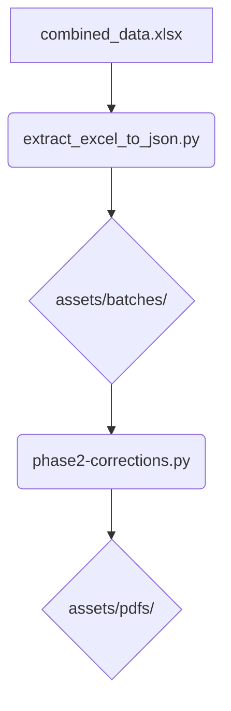

# Electoral Candidate Data Scraping

This project automates the process of extracting electoral candidate data from a government website. It handles data extraction, captcha solving, PDF downloading, and organizing the downloaded files for further processing.

Ensure you have Chrome browser installed (for Selenium automation).

## Project Structure



## Overview

The project consists of the following main components:

*   `extract_excel_to_json.py`: Converts the Excel data containing electoral candidate information into JSON batch files.
*   `phase2-corrections.py`: Downloads PDF files for each candidate, solves captchas, and organizes the downloaded PDFs into a structured directory.

## Requirements

The project requires the following Python packages:

*   `pandas`
*   `openpyxl`
*   `selenium`
*   `mistralai`
*   `requests`
*   `python-dotenv`

To install the requirements, run:

```bash
pip install -r requirements.txt
```

## Setup

1.  **Install Dependencies:**

    ```bash
    pip install -r requirements.txt
    ```

2.  **Environment Variables:**

    *   The `phase2-corrections.py` script requires the `MISTRAL_API_KEY` environment variable to be set. This API key is used to solve captchas using the Mistral AI API. You can obtain an API key from the [Mistral AI website](https://mistral.ai/).

    *   Set the `OPENWEATHER_API_KEY` environment variable.

## Usage

### Step 1: Data Preparation (Phase 1)

The first step converts an Excel file containing candidate data into manageable JSON batch files.

1.  Place your Excel file at `assets/combined_data.xlsx`
2.  Run the extraction script:

    ```bash
    python extract_excel_to_json.py
    ```

    This script will:

    *   Convert the Excel data to JSON format
    *   Split the data into multiple batch files (500 entries per batch by default)
    *   Create a batch index file to track processing status
    *   Set up the necessary folder structure

### Step 2: PDF Download (Phase 2)

This step visits the website for each candidate, solves the CAPTCHA, and downloads their PDF.

1.  Run the batch processing script:

    ```bash
    python phase2-corrections.py
    ```

    The script will:

    *   Process each candidate in the batches
    *   Solve CAPTCHAs using Mistral AI
    *   Download PDF files
    *   Organize PDFs in a structured folder hierarchy based on district/block/village
    *   Track progress and handle errors gracefully

#### Configuration Options

You can modify these variables at the top of `phase2-corrections.py`:

*   `START_ID`: Set to a specific ID to skip entries (e.g., 2001 to skip first 2000 entries)
*   `BATCH_SIZE`: Change the number of entries per batch (default is 500)
*   `MIN_DELAY`/`MAX_DELAY`: Adjust the waiting time between requests

### Future Steps

The project roadmap includes:

*   **Phase 3**: Extract PNG images from PDF files
*   **Phase 4**: Use Google AI API to extract information from images

## How It Works

### Data Processing Flow

1.  **Excel to JSON Conversion**:

    *   Reads from Excel file
    *   Creates JSON batches with status tracking
    *   Generates a batch index file

2.  **Batch Processing**:

    *   Loads batch data
    *   Processes entries one by one
    *   Downloads PDFs via Selenium automation
    *   Organizes files by district/block/village

3.  **CAPTCHA Solving**:

    *   Captures the CAPTCHA image
    *   Uses Mistral AI to solve the CAPTCHA
    *   Handles retries when CAPTCHA solution fails

4.  **Progress Tracking**:

    *   Updates entry status in JSON files
    *   Updates batch status in index file
    *   Provides time estimates and progress information

## Data Flow



## Directory Structure

*   `assets/`: Contains the Excel file, JSON batch files, and the batch index file.
*   `assets/batches/`: Contains the JSON batch files.
*   `assets/images/`: Contains the captcha images.
*   `assets/pdfs/`: Contains the downloaded PDF files, organized into a structured directory based on district, block, and village.

## Troubleshooting

*   **Downloads not working**: Ensure Chrome can access the download directory
*   **CAPTCHA solving fails**: Check your Mistral API key and internet connection
*   **Script crashes**: Check the JSON files to resume from where it stopped

## Notes

*   The scripts include random delays between requests to avoid being blocked
*   Files are organized in a structured manner for easy access and further processing
*   Progress is saved after each entry to ensure no work is lost if the script stops

## Configuration

The following configuration variables can be set in the `phase2-corrections.py` script:

*   `START_ID`: The ID to start processing from. Set to `None` to process all entries.
*   `BATCH_SIZE`: The size of each batch.
*   `MIN_DELAY`: The minimum delay between requests (seconds).
*   `MAX_DELAY`: The maximum delay between requests (seconds).
